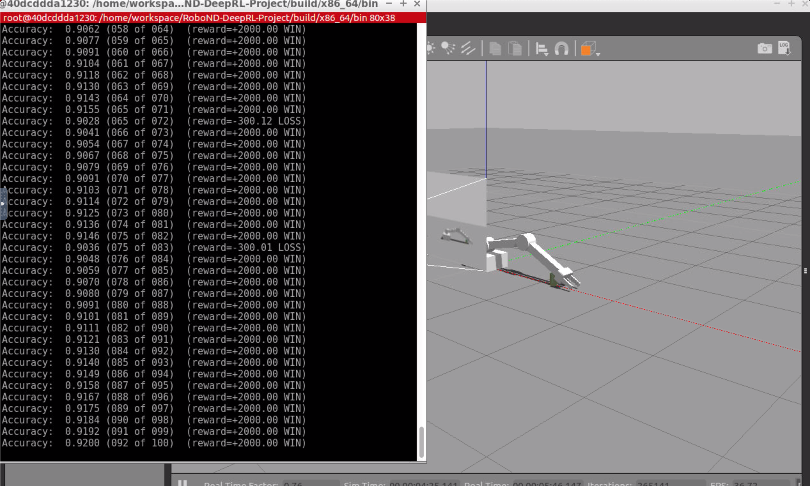
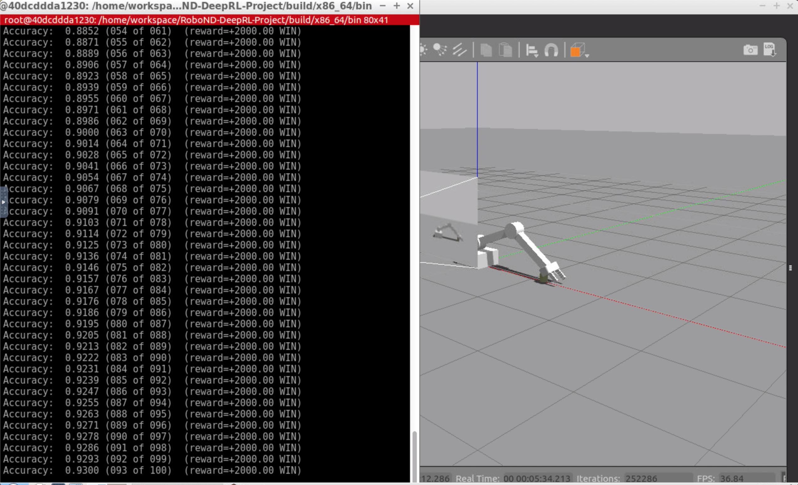

# Deep RL Arm Manipulation

Seongyoon Cho

## Reward Functions

#### Reward Constants

The constants for winning and losing rewards are defined like these. 
```
REWARD_WIN = 2000.0f
REWARD_LOSS = -2000.0f
```

#### Goal Reward
`reward = REWARD_WIN`

If the robot achieves the goal, `REWARD_WIN` is issued and the episode ends. This value is set to a relatively high to give a significant amount of reward compared to **interim reward** introduced later. The reward is the same for both tasks, a task for any part of a robot arm touches the object, and the other task for gripper base touches the object. 

#### Reward for Touching the Ground
`reward = REWARD_LOSS * distGoal`

If the gripper base touches the ground, a negative reward is issued, and the episode ends. This value is multiplied by a distance between the gripper and the target object. i.e., if the gripper touches the ground far from the target object, a more significant negative value is issued. If the gripper just slightly misses the target object and hit the ground, a small negative value is issued.

#### Interim Reward
`avgGoalDelta  = (avgGoalDelta * alpha) + (distDelta * (1.0f - alpha))`

While the robot is in motion, an interim reward is issued to encourage robot to move towards to the target. The reward is smoothed with an alpha value of 0.2.

#### Joint Control
Both velocity control and position control is implemented for this project. But only position control made a promising result. Velocity control shows smoother movements but somehow failed to achieve over 0.7 of accuracy for task 2.

## Hyperparameters

#### `INPUT_WIDTH ` and `INPUT_HEIGHT `
512 is so big that it causes memory problems. 64 is chosen because it's small enough to run smoothly and big enough to get information.
 
#### `OPTIMIZER`
`RMSprop` is selected because it's a popular choice. It's a gradient descent with momentum, so it reduces oscillations and converges faster. 

#### `LEARNING_RATE` 
After many trial and errors, 0.05 is selected. If I set it higher, sometimes the accuracy oscillates. If I set it lower, it takes too long to achieve the desired accuracy or even it gets stuck on low accuracy. 

#### `REPLAY_MEMORY` and `BATCH_SIZE`
Replay memory is left to 10000 as it is. Batch size is slightly increased to 64. There were no memory issues.

#### `USE_LSTM` and `LSTM_SIZE`
To utilize LSTM, `USE_LSTM` is set to `true` and `LSTM_SIZE` is set to 256.

## Results

With some iterations, I could get successful results which satisfy both conditions. But how fast it converges depends on starting a few episodes. If it starts with successful episodes, it seldom tries other things and successfully converges over 90 percent accuracy. But if it starts with some errornous episodes, it takes longer to achieve 90 percent accuracy. Sometimes, it takes more than 300 episodes.

#### Collision between the arm and the object

This is one of the most successful runs.  You can see the arm tries various angles at first few episodes. Also, there's a lot of hesitations. Afterward, the angle is constant and no hesitation at all. The accuracy 92 percent.


https://youtu.be/7NeBbCoMLow

#### Collision between the gripper base and the  object

One interesting thing I noticed with this run is, at around 90 episodes, if the arm reaches too far, it immediately corrects the angle. The accuracy is 93 percent.


https://youtu.be/YwkcPO7HAZE

## Future Works

#### Velocity control

It would be great if I could successfully achieve the goal with velocity control. The movement itself is more natural than position control, that means it needs smaller torque and consumes less power. But it was difficult to achieve an accuracy of more than 70 percent.

#### Faster converge

If the first few episodes fail, it takes very long to converge. this could be resolved with manipulating parameters like **LTSM size** or **Interim reward**.
